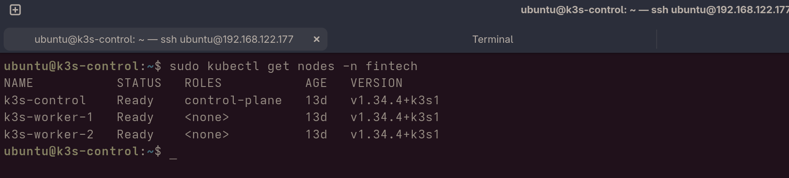
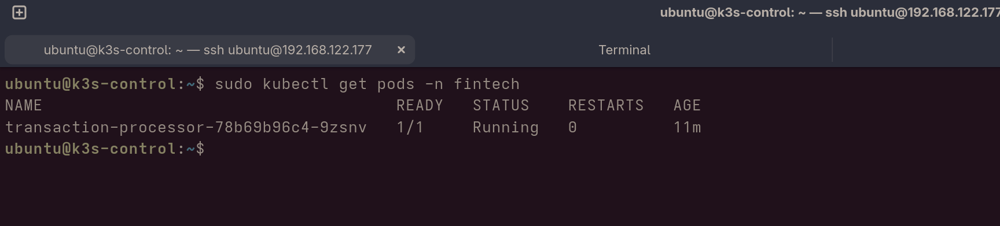
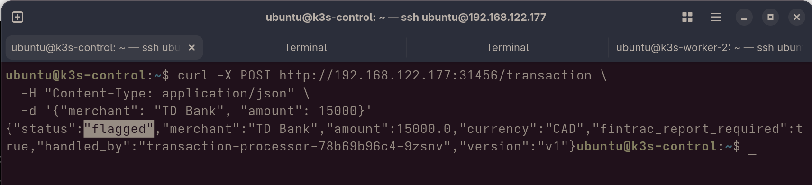
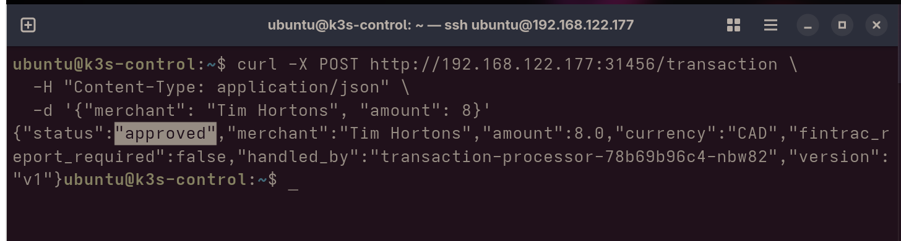
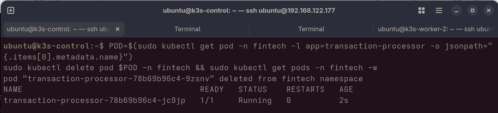
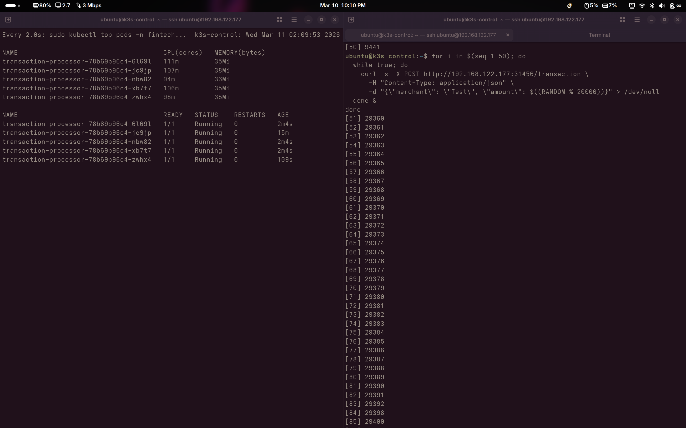
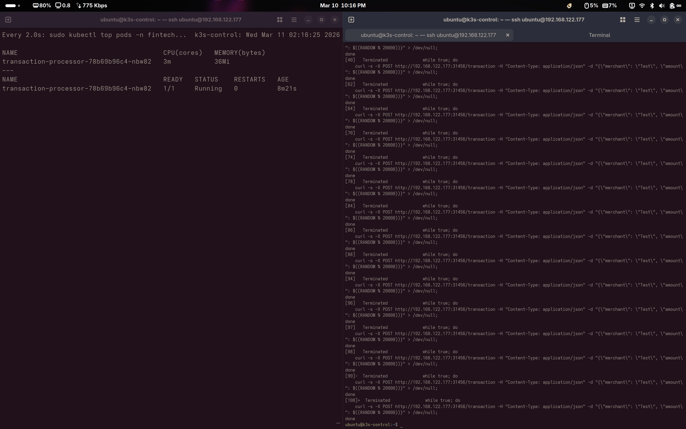

# fintech-fraud-detection

A financial transaction processor that flags suspicious amounts above the FINTRAC $10,000 CAD reporting threshold, deployed on a self-hosted 3-node Kubernetes cluster running on KVM/QEMU virtual machines.

## What This Demonstrates

| Concept | How |
|---|---|
| **Self-healing** | Delete a pod — Kubernetes detects the failure and automatically schedules a replacement |
| **Horizontal autoscaling (HPA)** | Flood with traffic — pods scale from 1 → 5 automatically, then back to 1 when idle |
| **Load balancing** | Every response includes `handled_by: <pod-name>` showing traffic distributed across replicas |
| **Rolling updates** | Apply v2 manifest — old pods replaced one by one with zero downtime |
| **Namespaces** | All workloads isolated in the `fintech` namespace |

## Infrastructure

- **Hypervisor:** KVM/QEMU on Nobara Linux
- **Nodes:** 3x Ubuntu 22.04 VMs (k3s-control, k3s-worker-1, k3s-worker-2)
- **Kubernetes:** k3s v1.34.4
- **App:** Python 3.11 + FastAPI

---

## Screenshots

### 1. The Cluster — 3 Nodes Ready

*The foundation of the project: a self-hosted 3-node Kubernetes cluster running on virtual machines. All three nodes (one control plane, two workers) show STATUS: Ready — meaning the cluster is healthy and able to schedule workloads.*

---

### 2. Application Deployed — Pod Running

*The transaction processor application is deployed and running inside the `fintech` namespace. STATUS: Running and READY: 1/1 confirms the app is live and accepting requests.*

---

### 3. Transaction Flagged — FINTRAC Threshold Triggered

*A $15,000 CAD transaction from TD Bank is processed. Because the amount exceeds the $10,000 FINTRAC reporting threshold, the API returns `"status": "flagged"` and `"fintrac_report_required": true`. The `handled_by` field shows which pod processed the request.*

---

### 4. Transaction Approved — Below Threshold

*An $8 CAD transaction from Tim Hortons is processed. The amount is below the threshold so the API returns `"status": "approved"` and `"fintrac_report_required": false`. This confirms the flagging logic correctly distinguishes between transactions.*

---

### 5. Self-Healing — Automatic Pod Recovery

*The pod is manually deleted to simulate a crash. Kubernetes immediately detects the missing pod and schedules a replacement — the new pod is Running within 2 seconds with zero manual intervention.*

---

### 6. HPA Scale-Up — 1 Pod Grows to 5 Under Load

*50 parallel workers flood the API with requests, pushing CPU usage to ~110m per pod (above the 50m threshold). The Horizontal Pod Autoscaler automatically scales from 1 pod to 5 pods to handle the load.*

---

### 7. HPA Scale-Down — Back to 1 Pod When Idle

*Once the load test stops, CPU drops back to ~3m. After a cooldown period, the HPA automatically terminates the extra pods and scales back down to 1 — releasing resources when they are no longer needed.*

---

## API

**Health check**
```
GET /
```
```json
{ "status": "ok", "pod": "transaction-processor-abc123", "version": "v1" }
```

**Process transaction**
```
POST /transaction
{ "merchant": "TD Bank", "amount": 15000, "currency": "CAD" }
```
```json
{
  "status": "flagged",
  "merchant": "TD Bank",
  "amount": 15000.0,
  "currency": "CAD",
  "fintrac_report_required": true,
  "handled_by": "transaction-processor-abc123",
  "version": "v1"
}
```

---

## Deploy

### 1. Build and push the image
```bash
cd app/
docker build -t myviewsontech/fintech-fraud-detection:v1 .
docker push myviewsontech/fintech-fraud-detection:v1
```

### 2. Deploy to cluster
```bash
kubectl apply -f k8s/namespace.yaml
kubectl apply -f k8s/deployment.yaml
kubectl apply -f k8s/service.yaml
kubectl apply -f k8s/hpa.yaml
```

### 3. Verify
```bash
kubectl get pods -n fintech
kubectl get svc -n fintech
```

---

## Demos

### Self-healing
```bash
bash scripts/demo-self-healing.sh
```

### Load test (triggers HPA)
```bash
# Terminal 1 - watch pods scale
kubectl get pods -n fintech -w

# Terminal 2 - send traffic
for i in $(seq 1 50); do
  while true; do
    curl -s -X POST http://<NODE-IP>:31456/transaction \
      -H "Content-Type: application/json" \
      -d "{\"merchant\": \"Test\", \"amount\": $((RANDOM % 20000))}" > /dev/null
  done &
done
```

### Rolling update
```bash
bash scripts/demo-rolling-update.sh
```

---

## Project Structure

```
fintech-fraud-detection/
├── app/
│   ├── main.py
│   ├── Dockerfile
│   └── requirements.txt
├── infrastructure/
│   └── create-vms.sh
├── k8s/
│   ├── namespace.yaml
│   ├── deployment.yaml
│   ├── service.yaml
│   ├── hpa.yaml
│   └── rolling-update/
│       └── deployment-v2.yaml
├── screenshots/
└── scripts/
    ├── demo-self-healing.sh
    ├── demo-rolling-update.sh
    └── load-test.sh
```
